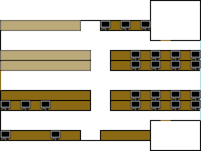

# Introdução

O presente trabalho foi motivado pela promoção de diversas campanhas, como a [prompt](http://prompt.engineyard.com/), sobre o impacto de atividades na indústria de tecnologia da informação tem sobre a saúde mental dos trabalhadores da área, e um [relatório recente](http://www.headsup.org.au:8080/docs/default-source/resources/beyondblue_workplaceroi_finalreport_may-2014.pdf?sfvrsn=2), financiado pelo governo da Austrália sobre o retorno sobre investimento (ROI) na manutenção de espaços de trabalho que promovem saúde mental.

# Descrição da empresa

Para o presente trabalho foi realizada a análise de uma empresa do setor de Tecnologia da Informação registrada na Junta Comercial do Estado do Rio Grande do Sul em abril de 2007 e com sede em Porto Alegre. Inicialmente, a empresa fornecia serviços em plataforma web através de convênio com seccionais da Ordem dos Advogados do Brasil e contato direto com escritórios de advocacia, mas atualmente está em expansão de escopo para atingir mais clientes que precisam de soluções empresariais em TI, ultrapassando a marca atual de 77 mil clientes em todo território brasileiro.

A empresa possui um quadro de 135 colaboradores que se dividem nos seguintes setores:

_Setor administrativo._ Abrange todas as atividades de controle financeiro e gestão de recursos humanos da empresa.

_Setor de Identidade Profissional._ Composto de poucos profissionais de relacionamento direto com o cliente e designers, é responsável pela criação de produtos de identidade visual para clientes externos e internos, como logotipos e papelaria.

_Central de Relacionamento._ O maior setor da empresa. Possui a estrutura de uma central de telemarketing e subdivide-se em núcleos de venda, pós-venda, suporte, cobrança, recuperação de contratos etc.

_Setor de Tecnologia da Informação._ Composto de coordenadorias de Arquitetura, Infraestrutura, Planejamento de Produto e Desenvolvimento, é estruturado como um departamento de TI típico, excetuando-se que não foi adotado o _sistema de acordo de banco de horas_ para distribuição da jornada de trabalho.

O foco da análise apresentada será o Setor de Tecnologia da Informação.

## Jornada de trabalho

A fim de manter um regimento interno equivalente e com o mínimo de particularidades entre a Central de Relacionamento, que deve manter atividade constante no horário de atendimento, e o setor de Tecnologia da Informação, que não precisa de horários fixos mesmo em atividades de operação, foi estabelecido, mediante acordo, que cada colaborador poderia definir uma distribuição do trabalho ao longo das oito horas diárias que fosse o mais adequado. Assim, o período de atividade é de 7h20 às 19h20, respeitando os intervalos obrigatórios previstos em lei.

# Distribuição de colaboradores no setor avaliado

As atividades realizadas pelos colaboradores são dividas com base nas coordenadorias, de modo que existem profissionais nos cargos de:

- webdesigner: 4 colaboradores;
- programador de sistemas de informação: 10 colaboradores;
- administrador de banco de dados: 1 colaborador;
- suporte técnico: 2 colaboradores;
- administradores de sistemas: 3 colaboradores.

Cabe destacar que existem apenas duas mulheres no setor, ambas programadoras.

# Processo de produção avaliado

Embora quase todos os colaboradores do setor desenvolvam atividades de projeto e planejamento, serão avaliados os riscos para a atividade de _operação_, desenvolvida majoritariamente pelos webdesigners, programadores e administradores de sistemas. Esta atividade pode ter seu fluxo de trabalho resumido como receber requisições através de um sistema de rastreamento de incidentes (_incident ticket system_) alimentado pelos profissionais da Central de Relacionamento e atuar em regime de urgência em sistemas que já estão em ambiente de produção, isto é, sistemas informatizados que já estão sendo executados e sendo alimentados com dados de clientes. Incidentes típicos registrados incluem:

- indisponibilidade de servidores;
- dados corrompidos ou incorretos;
- correções na interface visual;
- dúvidas que o núcleo de suporte não pode esclarecer etc.

# Espaço de trabalho

# Identificação dos riscos ambientais

A empresa não paga adicionais de insalubridade (NR-15) e periculosidade (NR-16). Há Comissão Interna de Prevenção de Acidentes (CIPA, NR-5), escolhida conjuntamente ao conselho de colaboradores e mantém com rigor o Programa de Controle Médico de Saúde Ocupacional (PCMSO, NR-7) e o Programa de Prevenção de Riscos Ambientais (PPRA, NR-9). E, embora não disponha de Serviços Especializados de Engenharia de Segurança e em Medicina do Trabalho (SESMT), foi recentemente contratada uma massoterapeuta com especialização em Fisioterapia Ocupacional. Entre as métricas de monitoramento de Recursos Humanos, foram adicionados indicadores de acidentes no trabalho e doenças ocupacionais, pois alguns colaboradores apontaram problemas de saúde relacionados ao sedentarismo, como estresse, hipertensão, obesidade e problemas do trato gastroinstestinal (o único registro de afastamento pela Previdência Social foi relacionado a úlcera gástrica).

Seguem os riscos identificados no setor.

## 1. Risco físico

- Causa: calor/frio
- Fonte: sistema de ar condicionado
- Consequência: doenças respiratórias, doença de Raynaud, síndrome de Sjögren (xerostomia e xeroftalmia)
- Medidas de controle coletivas: dimensionamento adequado dos ambientes condicionados, distribuição calculada dos condicionadores, limpeza periódica dos filtros, respeito à ABNT NBR 16401-2 (parâmetros de conforto térmico)
- Medidas de controle individuais: uso de roupas adequadas à estação do ano, distanciamento de regiões de circulação de ar condicionado
- Risco não controlado.

## 2. Risco físico

- Causa: radiação
- Fonte: monitores dos computadores
- Consequência: xeroftalmia, aceleração da degeneração macular relacionada à idade (ARMD), alteração no ritmo circadiano, queimadura da retina
- Medidas de controle coletivas: aferição periódica da radiação, substituição de equipamento defeituoso
- Medidas de controle individuais: distância mínima de 50cm entre os olhos e a tela, piscar constantemente (dado que o movimento é semi-autônomo)
- Risco controlado com aferição realizada por empresa terceirizada.

## 3. Risco biomecânico

- Causa: postura inadequada
- Fonte: posto de trabalho sentado
- Consequência: sedentarismo, lordose, cifose, estase sanguínea dos membros inferiores
- Medidas de controle coletivas: adoção de assentos com regulagem de altura do assento, altura do apoio de costas e altura dos apoios para os braços, ginástica laboral, massagem preventiva para lombalgia
- Medidas de controle individuais: postura correta, pausas regulares na jornada de trabalho
- Risco controlado com cadeiras adequadas e massoterapia.

## 4. Risco biomecânico

- Causa: posição inadequada para os punhos
- Fonte: uso de mouse e teclado
- Consequência: epicondilite lateral, tendinite, lesões por esforço repetitivo (LER) em geral
- Medidas de controle coletivas: disponibilização de equipamentos ergonômicos e apoios para os punhos
- Medidas de controle individuais: pausas regulares na jornada de trabalho, ginástica laboral, automatização de tarefas que exigem grande interação do usuário de computador
- Risco não controlado.

## 5. Risco psicossocial

- Causa: carga de trabalho excessiva
- Fonte: utilização do sistema de rastreamento de incidentes
- Consequência: estresse, esgotamento (_burnout_)
- Medidas de controle coletivas: treinamento adequado para utilização do sistema de rastreamento de incidentes, alteração do fluxo de trabalho nas atividades de operação
- Medidas de controle individuais: psicoterapia ocupacional regular
- Risco não controlado.

# Conclusão

Como uma empresa de médio porte, a analisada apresenta, além da conformidade com as Normas Regulamentadoras de Segurança do Trabalho, desejo de aumentar a produtividade garantindo um ambiente de higiene adequada e um ambiente que fornece conforto aos colaboradores. Enquanto a minimização de alguns riscos depende de grande investimento financeiro, boa parte deles exige apenas campanhas internas para conscientização dos colaboradores, que pode ser uma solução de curto-prazo. Para longo prazo, alguns processos burocráticos devem ser revistos.

# Referências

1. MINISTÉRIO DO TRABALHO E EMPREGOS. Site www.mte.gov.br – Inspeção do Trabalho – Legislação – Normas Regulamentadoras.
2. "Health effects of lighting systems using light-emitting diodes (LEDs)", ATTIA, D., ANSES. Set/2011.
